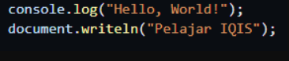
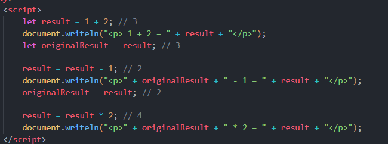
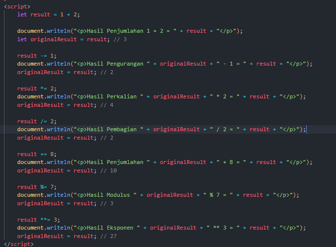
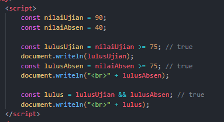
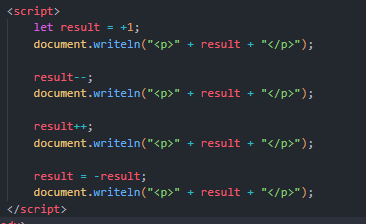
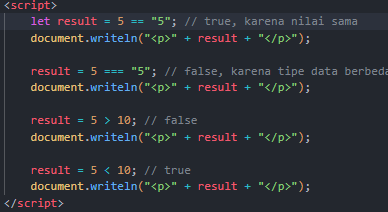
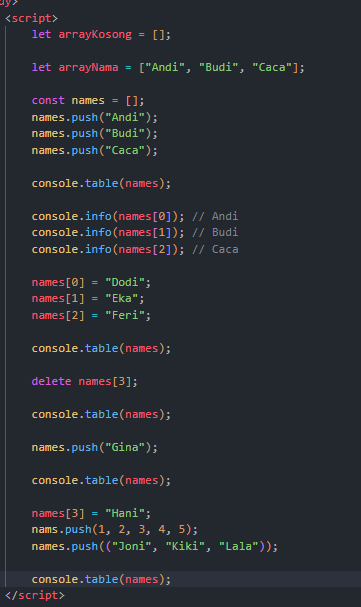
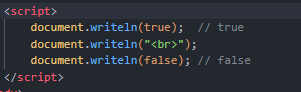
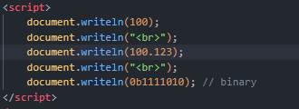

<h4>Switch & If else</h4>
Penjelasan Switch :
Jika Const/variabel (nilai) bernial "A" maka yang akan tercetak adalah case "A" = 'Wow anda Lulus dengan baik', case "B" dan case "C" kedua case ini di gabung maka hasilnya "Anda lulus", Jika Case "D" maka baris di bawahnya yg tercetak "Mungkin Anda salah Jurusan"
dan jika case memiliki nilai selain dari pada case tersebut maka hasil nya itu default

Penjelasan If else :
if (nilai === "A") = Jika Nilai === (Mengecek isi dan typedatanya) nya "A" maka, hasil nya "wow Anda Lulus dengan Baik"
else if (nilai === "B" || nilai === "C") = Dan jika nilainya "B" dan sama dengan "C" maka hasilnya "anda Lulus", || (mengecek jika salah satunya benar maka benar/true)
else if (nilai === "D") = jika nilai "D", Hasilnya "anda Tidak Lulus"
else = jika tidak ada kondisi yg terpenuhi, hasilnya "mungkin anda salah jurusan"

Perbedaan kedua nya

Kalau if else, fleksibel di pakai jika banyak kondisi, bisa berupa umur/angka/ atau kondisi yg pake > < =, fleksibel yg berarti mudah menyesuaikan / bisa di pakai banyak situasi
Switch, di gunakan kalau kondisinya sudah fix / tetap, seperti "A" , "B" , "C" dan sudah pasti nilainya, atau angka tertentu, atau Hari, jadi pilihan opsi nya sudah fix dan tetap

<h4>Hello World</h4>>

Bisa menggunakan console.log ("Hello, World!" ); & document.writeln ("pelajar IQIS");
hasil dari console.log akan muncul di console, hasil dari document.writeln akan muncul di halaman depan

<h4>ARITMATIKA</h4>

let result = 1 + 2; // 3 = melakukan operasi 1 + 2 
document.writeln("
 1 + 2 = " + result + "
"); = mencetak 1 + 2 dan hasil dari result = 3
let originalResult = result; // 3 = menyimpan nilai result yaitu 3

result = result - 1; // 2 = melakukan operasi result yaitu 3 - 1 = 2
document.writeln("
" + originalResult + " - 1 = " + result + "
"); = mencetak originalresult yaitu 3 - 1 dan mencetak = hasil result yaitu 2
originalResult = result; // 2 = orinal resultnya 2 

result = result * 2; // 4 = operasi perkalian, hasil resut sebelumnya yaitu 2 di kali dengan 2
document.writeln("
" + originalResult + " * 2 = " + result + "
"); = mencetak orinalresult = result yaitu 2 dan di kali dengan 2, dengan hasil result, yaitu 2 * 2 = 4

<h4>AUGMENTED</h4>

Augmented Assignment adalah cara singkat untuk mengubah nilai variabel dengan operasi matematika sekaligus menugaskannya kembali, misalnya x += 2 sama dengan x = x + 2. Fungsinya mempermudah penulisan kode karena menambahkan atau mengubah nilai variabel dari nilai sebelumnya tanpa menulis ulang seluruh perhitungan.

<h4>Operator Logika</h4>

Kode ini menggunakan operator logika && untuk menentukan kelulusan siswa. Pertama, lulusUjian dicek apakah nilaiUjian >= 75 (true karena 90 ≥ 75) dan lulusAbsen dicek apakah nilaiAbsen >= 75 (false karena 40 < 75). Kemudian, lulus = lulusUjian && lulusAbsen akan bernilai false karena operator && hanya menghasilkan true jika kedua kondisi benar. Hasil akhirnya ditampilkan di halaman menggunakan document.writeln.

<h4>Operator Unary</h4>

Kode ini menunjukkan penggunaan operator unary, yaitu operator yang hanya membutuhkan satu nilai untuk bekerja. Pertama, nilai awal diberi +1, sehingga menjadi 1. Kemudian operator -- mengurangi nilai menjadi 0, ++ menambahnya kembali menjadi 1, dan - membalik tanda nilai menjadi -1. Setiap langkah menunjukkan bagaimana operator unary dapat memodifikasi atau membalik nilai variabel secara langsung dengan cara yang sederhana.

<h4>Operator Perbandingan</h4>

Operator Pembanding, Membandingkan dua nilai, contoh: ==, !=, >, <, >=, <=. Fungsinya mengevaluasi hubungan antar nilai dan mengembalikan true atau false.

<h4>Tipe Data Array</h4>

Array adalah struktur data yang bisa menyimpan banyak nilai dalam satu variabel. Misalnya, angka = [10, 20, 30] menyimpan tiga angka sekaligus. Fungsinya untuk mengelompokkan data seperti daftar nama, nilai, atau item sehingga mudah diakses dan dikelola dalam satu tempat.

<h4>Tipe Data boolean</h4>

Boolean adalah tipe data yang hanya memiliki dua nilai, yaitu true dan false. Fungsinya untuk menyimpan hasil logika dalam program, misalnya hasil perbandingan atau kondisi dalam percabangan if, sehingga program bisa mengambil keputusan berdasarkan kondisi tersebut.

<h4>Tipe data number</h4>

Menyimpan angka baik bilangan bulat maupun desimal. Fungsinya digunakan untuk operasi matematika dan perhitungan dalam program.

<h4>Tipe data object</h4>

